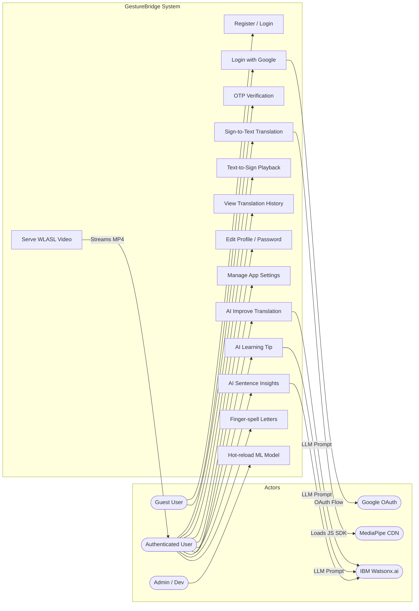
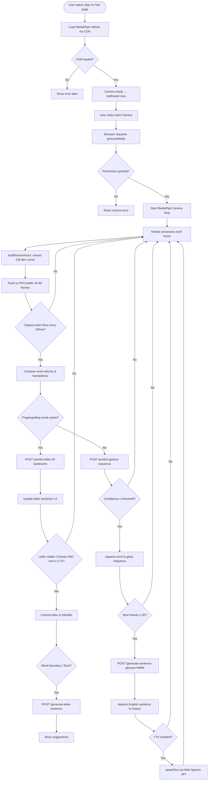
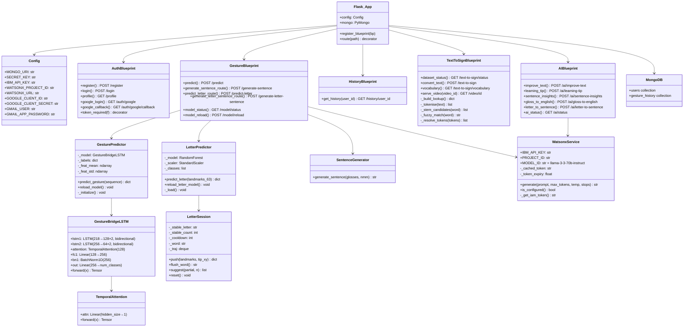
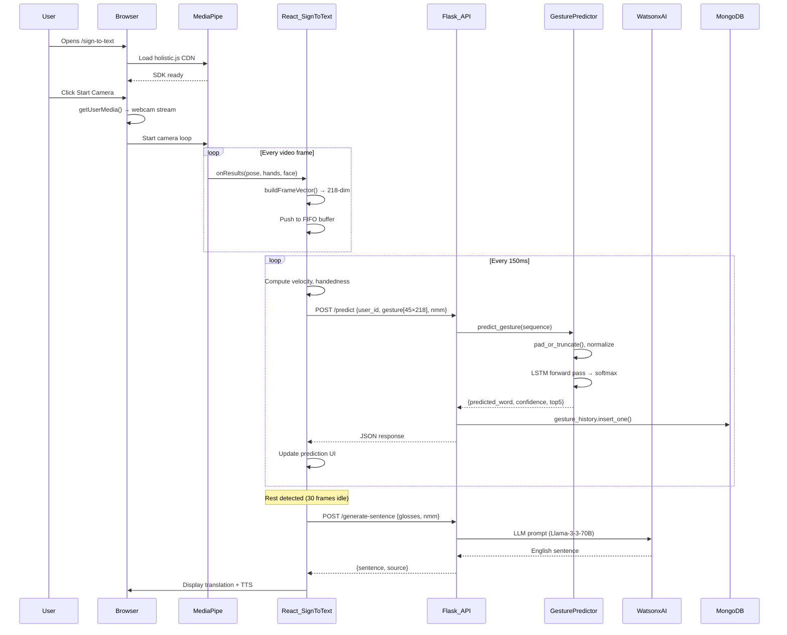
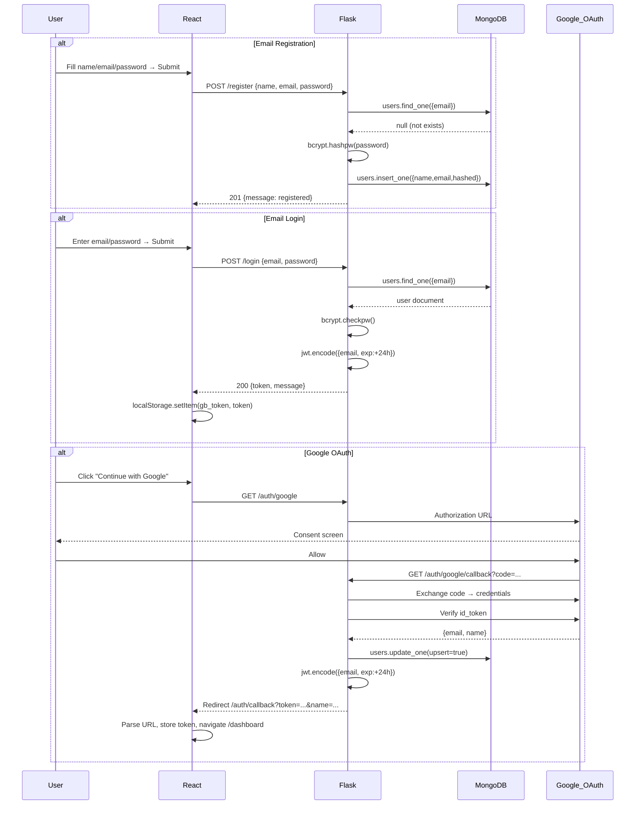
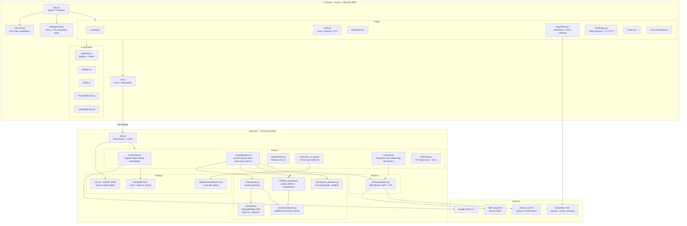
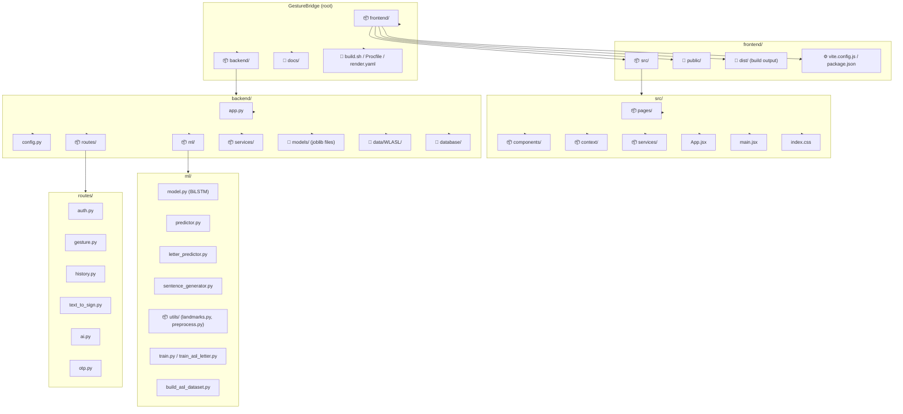
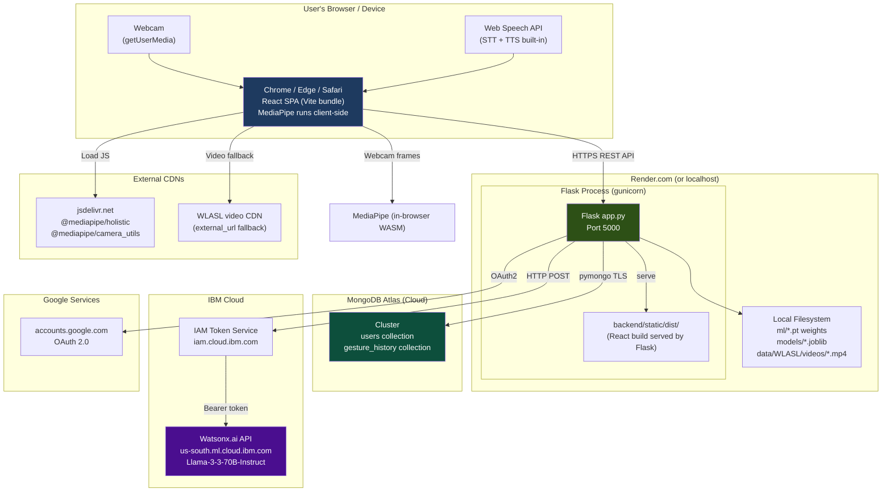
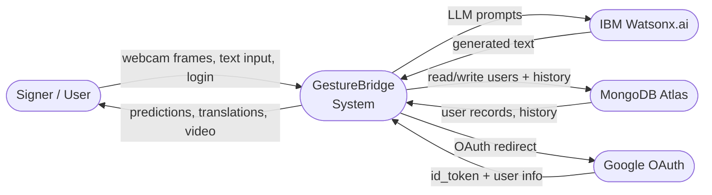
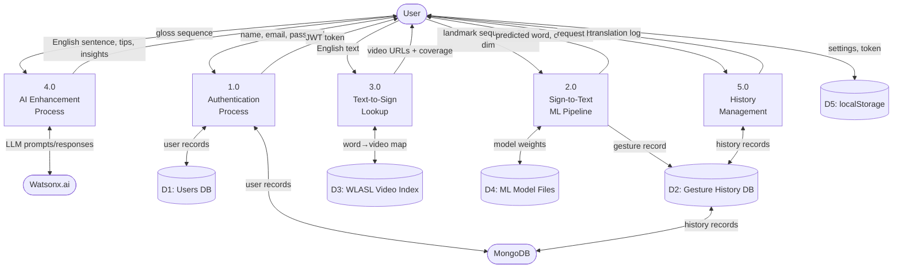

# GestureBridge — Complete UML & System Diagrams

All diagrams are written in **Mermaid** syntax and render natively in GitHub, GitLab, VS Code (with Markdown Preview Mermaid Support), and any Mermaid-aware viewer.

---

## 1. Use Case Diagram



---

## 2. Activity Diagram — Sign-to-Text Main Flow



---

## 3. Activity Diagram — Text-to-Sign Flow

```mermaid
flowchart TD
    A([User types text]) --> B[Select language ASL/Hindi/Marathi]
    B --> C{Use Speech-to-Text?}
    C -- Yes --> D[SpeechRecognition API listens]
    D --> E[Transcript fills text box]
    C -- No --> E
    E --> F[User clicks Show Signs]
    F --> G[POST /text-to-sign with text]
    G --> H[Backend tokenises text]
    H --> I[Bigram check in _WORD_LOOKUP]
    I --> J{Bigram found?}
    J -- Yes --> K[Add bigram entry]
    J -- No --> L[Exact word match?]
    L -- Yes --> M[Add word entry]
    L -- No --> N[Fuzzy / stem match?]
    N -- Yes --> O[Add fuzzy entry]
    N -- No --> P[Mark word not found]
    K & M & O & P --> Q[Return words[] + coverage]
    Q --> R[Frontend receives playable words]
    R --> S{autoAdvance = true?}
    S -- Yes --> T[Auto-play first video immediately]
    S -- No --> U[User clicks Play]
    T & U --> V[Load video: local /video/id or external URL]
    V --> W[Video plays]
    W --> X{onEnded fires?}
    X -- Yes --> Y{More words?}
    Y -- Yes --> V
    Y -- No --> Z[Playback complete]
    X -- No --> AA{User clicks Next/Prev?}
    AA -- Yes --> V
```

---

## 4. Class Diagram



---

## 5. Sequence Diagram — Sign-to-Text Recognition



---

## 6. Sequence Diagram — User Authentication



---

## 7. Component Diagram



---

## 8. Package Diagram



---

## 9. Deployment Diagram



---

## 10. Data Design Diagram

```mermaid
erDiagram
    USERS {
        ObjectId _id PK
        string name
        string email UK
        bytes password "bcrypt hash or null for OAuth"
        datetime created_at
    }

    GESTURE_HISTORY {
        ObjectId _id PK
        string user_id FK
        list gesture_input "T×218 landmark matrix"
        string predicted_text
        float confidence
        list top5 "top-5 predictions with scores"
        object nmm "NMM summary object"
        datetime timestamp
    }

    ASL_DATASET {
        ndarray X "N×45×218 landmark sequences"
        ndarray y "N integer class labels"
        source "database/asl_data.npz"
    }

    ASL_LETTER_MODEL {
        file model "asl_letter_model.joblib RandomForest"
        file scaler "asl_letter_scaler.joblib StandardScaler"
        file meta "asl_letter_meta.json classes+accuracy"
        file bundle "asl_letter_bundle.joblib fallback"
    }

    GESTURE_MODEL {
        file weights "ml/gesture_model.pt PyTorch state_dict"
        file labels "ml/labels.json idx to word"
        file meta "ml/model_meta.json seq_len+feat_size"
        file normalizer "ml/normalizer.npz mean+std"
    }

    WLASL_VOCAB {
        file json "data/WLASL/curated_WLASL.json"
        string gloss "sign word"
        list instances "video_id + split + url"
        file videos "data/WLASL/videos/*.mp4"
    }

    SETTINGS_LOCAL {
        string gb_token "JWT in localStorage"
        string gb_user "user JSON in localStorage"
        string gb_settings "theme+TTS+mode JSON"
    }

    USERS ||--o{ GESTURE_HISTORY : "has many"
    GESTURE_HISTORY }o--|| GESTURE_MODEL : "predicted by"
    ASL_DATASET ||--|| GESTURE_MODEL : "trained from"
    WLASL_VOCAB ||--o{ GESTURE_HISTORY : "word appears in"
```

---

## 11. Data Flow Diagram (DFD) — Level 0 (Context)



---

## 12. Data Flow Diagram (DFD) — Level 1 (System Processes)



---

## 13. Navigation Tree

```
GestureBridge Navigation Tree
├── / (Landing)
│   ├── → /login        (CTA: "Start Translating")
│   └── → /register     (CTA: "Get Started Free")
│
├── /login              (Auth.jsx — login tab)
│   ├── → /register     (link)
│   ├── → /auth/google  (Google OAuth button)
│   └── → /dashboard    (on successful login)
│
├── /register           (Auth.jsx — register tab)
│   ├── → /login        (link)
│   └── → OTP screen    (on register success)
│       └── → /dashboard (on OTP verified)
│
├── /auth/callback      (AuthCallback.jsx — handles Google redirect)
│   └── → /dashboard    (auto-redirect after storing token)
│
├── /dashboard          [PROTECTED]
│   ├── Sidebar → /sign-to-text
│   ├── Sidebar → /text-to-sign
│   ├── Sidebar → /history
│   ├── Sidebar → /account
│   └── Topbar  → logout
│
├── /sign-to-text       [PROTECTED]
│   ├── Mode tabs: Sign Mode | Spell Mode
│   ├── Start Camera → live webcam
│   ├── Gloss sequence panel
│   ├── Translation panel → AI Improve button
│   ├── Reading Now card (prediction + confidence)
│   ├── NMM card
│   ├── Top-5 predictions
│   ├── Letter-to-Sentence panel (Spell Mode)
│   └── Quick Tips
│
├── /text-to-sign       [PROTECTED]
│   ├── Language selector (ASL/Hindi/Marathi)
│   ├── Text input + Quick phrase chips
│   ├── 🎤 Speak button (STT)
│   ├── 🔊 Listen button (TTS)
│   ├── ▶ Show Signs → video player
│   │   ├── Progress bar
│   │   ├── Word chip strip (click to jump)
│   │   ├── AI Tip button
│   │   ├── Controls: Prev / Play / Pause / Next / Stop / Loop / Auto / Speed
│   │   └── Fullscreen
│   ├── Stats card (Signs Found / Skipped / Coverage)
│   ├── How It Works card
│   └── Supported Words vocab list
│
├── /history            [PROTECTED]
│   ├── Translation history list
│   ├── AI Insights button → /ai/sentence-insights
│   └── Per-entry detail
│
├── /account            [PROTECTED]  (alias: /profile, /settings)
│   ├── Tab: Profile → edit name
│   ├── Tab: Security → change password
│   ├── Tab: Appearance → theme / TTS settings
│   └── Danger Zone → reset settings
│
└── /* → redirect to /
```
